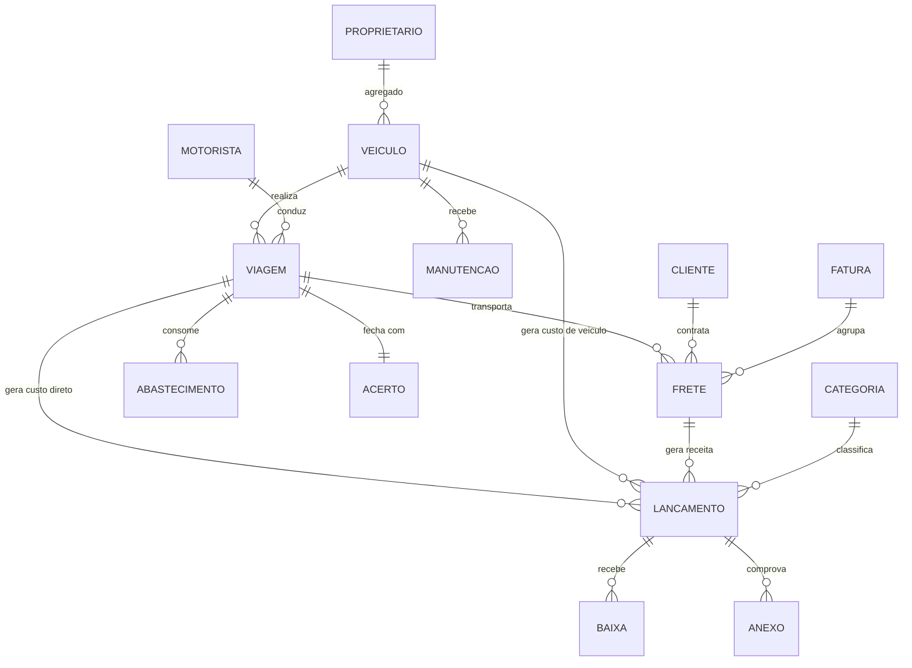

# 03 — Modelo de dados proposto

Modelo conceitual, **revisado após o levantamento da Lysor de 09/09/2026**
(`08-analise-do-levantamento.md`). As mudanças estruturais em relação à versão
anterior estão marcadas com 🔄.

Nomes finais e tipos exatos saem na migration, depois das confirmações da
seção 7 do documento 08.

---

## Diagrama de relacionamento



---

## Entidades

### `empresa` (registro único)
`id`, `razao_social`, `cnpj`, `timezone`, `config_rateio` (JSON: critérios da
cascata de custo)

> Sistema **single-tenant**: uma linha só. Serve para os dados do cabeçalho de
> relatório e para os parâmetros de rateio, não para isolamento de dados.

### `usuario`
`id`, `nome`, `email`, `senha_hash`, `perfil`
(`ADMIN` | `FINANCEIRO` | `OPERACAO` | `MOTORISTA`), `motorista_id?`, `ativo`

### `cliente`
`id`, `razao_social`, `cnpj`, `contato`, `prazo_pagamento_dias`,
`forma_faturamento` (`POR_CTE` | `AGRUPADO`), `ativo`

### `proprietario` (dono do agregado) 🔄
`id`, `nome`, `cpf_cnpj`, `tipo_pessoa` (`PF` | `PJ`), `dados_bancarios`
(cifrado), `contato`, `regra_cobranca` (JSON — ver abaixo), `ativo`

> 🔄 **Inversão confirmada no levantamento:** na Lysor o agregado **paga** a
> transportadora, não o contrário. O campo deixa de ser `regra_remuneracao`
> (quanto pagamos) e passa a ser `regra_cobranca` (quanto cobramos).

### `veiculo` 🔄
`id`, **`apelido`** (obrigatório), `placa`,
**`tipo`** (`CAVALO` | `CARRETA` | `TRUCK`),
`tipo_posse` (`PROPRIO` | `AGREGADO`), `proprietario_id?`,
`modelo`, `ano`, `eixos`, `tipo_carroceria`, `capacidade_kg`,
`capacidade_cabecas?`, `odometro_atual`, `data_aquisicao?`, `valor_aquisicao?`,
`status` (`ATIVO` | `MANUTENCAO` | `INATIVO` | `VENDIDO`)

> 🔄 **`apelido` é o identificador visível em toda a interface** — "Scania 440",
> "FH Vermelha", "Carreta Viloças". Nas folhas da Lysor não aparece uma única
> placa. Tela que mostra placa é tela que a cliente não reconhece. A placa fica
> no cadastro, para o CT-e e a documentação.
>
> 🔄 Cavalo e carreta são **veículos separados**, cada um com seus custos
> (inclusive ANTT por carreta). Odômetro só se aplica a `CAVALO`/`TRUCK`.

### `conjunto` 🔄 (cavalo + carreta com vigência)
`id`, `cavalo_id`, `carreta_id`, `inicio`, `fim?`

> A carreta é fixa por cavalo, mas *"às vezes acontece de trocar"*. A vigência
> faz o custo da carreta seguir o cavalo certo em cada período, sem reescrever
> histórico.

### `motorista`
`id`, `nome`, `cpf`, `cnh`, `cnh_categoria`, `cnh_validade`,
`vinculo` (`CLT` | `AUTONOMO` | `AGREGADO`), `regra_remuneracao` (JSON),
`veiculo_padrao_id?`, `ativo`

### `viagem` — **unidade de apropriação de custo**
`id`, `numero`, `veiculo_id`, `motorista_id`,
`data_saida`, `data_chegada?`,
`km_inicial`, `km_final?`, `km_carregado?`, `km_vazio?`,
**`km_improdutivo?`**, **`motivo_km_improdutivo?`**,
`origem`, `destino`,
`status` (`PLANEJADA` | `EM_ANDAMENTO` | `AGUARDANDO_ACERTO` | `FECHADA`),
`observacoes`

> 🔄 **`km_improdutivo`**: km rodado a mais por erro de terceiro — nas folhas da
> Lysor aparece *"andou 200 km — endereço errado"*, anotado e nunca cobrado.
> Com o motivo registrado, vira relatório por cliente e base factual de cobrança.
>
> 🔄 **`km_vazio` é a regra, não a exceção** neste cliente (transporte de gado
> raramente tem carga de retorno). Sem medi-lo, o custo por km faturado sai
> pela metade do real.

> `km_final >= km_inicial` e `km_inicial >= odometro_atual` do veículo.
> Violação **avisa**, não bloqueia — mas marca a viagem como incompleta.

### `frete` — **unidade de receita** (1 CT-e ou 1 OS) 🔄
`id`, `viagem_id?`, `cliente_id`,
**`modalidade`** (`FROTA_PROPRIA` | `AGREGADO`), `proprietario_id?`,
`numero_cte?`, `chave_cte?` (44 dígitos, único), `serie?`,
`origem`, `destino`, `produto`, `peso_kg?`, **`cabecas?`**, `volume?`,
**`valor_cte`**, **`valor_frete_real`**, **`valor_carga_nfe?`**,
`valor_pedagio_destacado?`, `valor_icms?`, `outras_receitas?`,
**`cte_complemento_de_id?`**,
**`valor_comissao_agregado?`**, **`valor_seguro_agregado?`**,
`data_emissao`, `data_coleta?`, `data_entrega?`,
`fatura_id?`, `status` (`ABERTO` | `ENTREGUE` | `FATURADO` | `CANCELADO`)

> 🔄 **Dois valores, sempre.** `valor_cte` é o fiscal, vem do XML.
> `valor_frete_real` é o gerencial, confirmado na tela. A cliente emite CT-e
> pelo mínimo em parte dos casos e nem sempre lança complemento — e a comissão
> de 12% do motorista incide sobre o **real**, assim como o lucro por frete.
> Quando são iguais, a tela resolve num clique.
>
> 🔄 **`modalidade` decide como a receita é reconhecida:**
>
> | modalidade | receita da Lysor | custo direto |
> |---|---|---|
> | `FROTA_PROPRIA` | `valor_frete_real` | diesel, pedágio, comissão do motorista |
> | `AGREGADO` | `valor_comissao_agregado` + `valor_seguro_agregado` | ≈ zero |
>
> 🔄 **`valor_carga_nfe`** é a base do seguro de 0,06% cobrado do agregado. Hoje
> é digitado à mão porque o relatório do emissor não traz — mas o XML do CT-e
> carrega em `infCarga/vCarga`. **Validar no primeiro XML real.**
>
> 🔄 **`cabecas`** — carga viva. A precificação informal da Lysor é por cabeça e
> por kg, convivendo com a tabela por km. O relatório precisa dos três.
>
> 🔄 **`cte_complemento_de_id`** liga um CT-e de complemento ao original, e
> permite o sistema apontar quando um complemento deixou de ser emitido.

### `abastecimento`
`id`, `veiculo_id`, `viagem_id?`, `motorista_id?`,
`data`, `fornecedor_id?`, `litros`, `valor_litro`, `valor_total`,
`odometro`, `tanque_cheio` (bool), `origem_dado` (`MANUAL` | `IMPORTADO`),
`lancamento_id`

> **km/l** = km percorrido entre dois abastecimentos de tanque cheio ÷ litros do
> segundo. Abastecimento parcial entra no acumulado, não fecha média.

### `manutencao`
`id`, `veiculo_id`, `data`, `odometro`,
`tipo` (`PREVENTIVA` | `CORRETIVA` | `PNEU` | `REVISAO`),
`fornecedor_id?`, `descricao`, `valor_pecas`, `valor_servico`, `lancamento_id`

### `categoria`
`id`, `nome`, `tipo`
(`RECEITA` | `DESPESA`),
**`nivel_custo`** (`DIRETO_VIAGEM` | `VEICULO` | `OVERHEAD`) ← define a camada da
cascata, `categoria_pai_id?`

Pré-carga: Receita de frete · Combustível · Pedágio · Manutenção · Pneus ·
Comissão/diária de motorista · Pagamento de agregado · Salários · Seguro ·
IPVA/Licenciamento · Financiamento · Depreciação · Rastreamento ·
Administrativo · Impostos · Despesa de viagem

### `lancamento` — **o título financeiro único**
`id`, `tipo` (`RECEITA` | `DESPESA`), `categoria_id`,
`descricao`, `valor`,
`data_competencia`, `data_vencimento`, `data_pagamento?`, `valor_pago`,
**apropriação:** `veiculo_id?`, `viagem_id?`, `frete_id?`
**contraparte:** `cliente_id?`, `fornecedor_id?`, `motorista_id?`, `proprietario_id?`
`recorrencia_id?`, `status` (`ABERTO` | `PARCIAL` | `LIQUIDADO` | `CANCELADO`),
`estorno_de_id?`, `criado_por`, `criado_em`,
**`forma_pagamento`** (`DINHEIRO` | `PIX` | `CHEQUE` | `BOLETO` | `CARTAO` | `TRANSFERENCIA`),
**`gatilho_vencimento`** (`DATA` | `AO_RECEBER`), **`lancamento_origem_id?`**,
**`parcela_numero?`**, **`parcela_total?`**, **`parcelamento_id?`**

> 🔄 **`gatilho_vencimento = AO_RECEBER`**: o acerto com o agregado acontece
> *"quando o cliente paga"*, CT-e a CT-e. O título a pagar não tem data — ele
> nasce quando o título a receber apontado por `lancamento_origem_id` é baixado.
> Sem isso, o fluxo de caixa projeta pagamento que não vai acontecer.
>
> 🔄 **Parcelamento**: as folhas da Lysor trazem *"parcelado cartão"* e
> *"parcelado boleto"* junto da despesa. Uma compra parcelada gera N títulos
> irmãos, com o mesmo `parcelamento_id`.
>
> 🔄 **`forma_pagamento`** é anotada junto de cada despesa nas folhas atuais —
> replicar isso mantém a cliente em terreno familiar.

> Regra: lançamento com `data_pagamento` preenchida é **imutável** — correção
> apenas por estorno.

### `baixa`
`id`, `lancamento_id`, `data`, `valor`, `conta_bancaria_id?`, `anexo_id?`

### `fatura`
`id`, `cliente_id`, `numero`, `periodo_inicio`, `periodo_fim`,
`valor_total`, `data_emissao`, `data_vencimento`, `lancamento_id`

### `acerto` (fechamento de viagem)
`id`, `viagem_id`, `tipo` (`MOTORISTA` | `AGREGADO`),
`valor_bruto`, `adiantamentos`, `descontos`, `despesas_reembolsadas`,
`valor_liquido`, `lancamento_id`, `fechado_em`, `fechado_por`

### `recorrencia`
`id`, `descricao`, `categoria_id`, `veiculo_id?`, `valor`,
`dia_vencimento`, `inicio`, `fim?`, `ativo`
→ gera `lancamento` mensal (seguro, IPVA parcelado, financiamento, rastreador,
depreciação, custos administrativos)

### `anexo`
`id`, `entidade`, `entidade_id`, `url`, `nome_arquivo`,
`mime`, `enviado_por`, `enviado_em`

### `auditoria`
`id`, `usuario_id`, `entidade`, `entidade_id`, `acao`,
`dados_antes` (JSON), `dados_depois` (JSON), `criado_em`

---

## Regras parametrizadas (JSON) 🔄

### `proprietario.regra_cobranca` — quanto a Lysor **cobra** do agregado

```jsonc
{
  "modelo": "PERCENTUAL_CTE_MAIS_SEGURO",
  "percentual_cte": 10.0,          // 10% sobre o valor do CT-e
  "base_percentual": "CTE_BRUTO",  // valor cheio, sem descontar pedágio/ICMS
  "percentual_seguro_carga": 0.06, // 0,06% sobre o valor da NFe da carga
  "quem_paga_combustivel": "AGREGADO",
  "quem_paga_pedagio": "AGREGADO",
  "descontos_aplicaveis": [],      // a Lysor não desconta nada além disso
  "momento_acerto": "AO_RECEBER"   // acerta quando o cliente paga aquele CT-e
}
```

Conferido contra o acerto real de 27/08/2026 (Dorival Osti): 7 CT-e somando
R$ 11.642,00 → comissão R$ 1.164,20; NFe de R$ 528.550,00 → seguro R$ 317,13;
total cobrado **R$ 1.481,33**. Os valores fecham exatamente.

### `motorista.regra_remuneracao` — quanto a Lysor **paga** ao motorista

```jsonc
{
  "modelo": "HIBRIDO",              // FIXO_MENSAL | COMISSAO | HIBRIDO
  "salario_fixo": 2805.50,          // 0 para os que só recebem comissão
  "percentual_comissao": 12.0,
  "base_comissao": "FRETE_REAL",    // ⚠️ não é o valor do CT-e
  "valor_diaria": 0,                // a Lysor não paga diária
  "adiantamento": false
}
```

> ⚠️ **`base_comissao = FRETE_REAL`** é o ponto mais delicado do modelo. A
> cliente foi explícita: a comissão incide *"sobre o frete efetivamente pago,
> pois às vezes fazemos cte pelo mínimo"*. Calcular sobre `valor_cte` produz
> comissão errada e folha errada.

Na Lysor hoje: 2 motoristas com `salario_fixo: 0` e 12% de comissão; 2 com
salário de R$ 2.805,50 **mais** os 12%.

## Views de relatório (materializadas)

| View | Conteúdo |
|---|---|
| `vw_resultado_veiculo_mes` | receita, custo direto, custo do veículo, margem, km, custo/km, R$/km, km/l, **% km vazio** |
| `vw_resultado_frete` | DRE em cascata por CT-e, com custo rateado da viagem, **R$/km · R$/cabeça · R$/kg** |
| `vw_resultado_viagem` | consolidado da viagem antes do rateio |
| `vw_resultado_cliente` | margem por embarcador, **+ km improdutivo do período** |
| `vw_resultado_rota` | 🔄 margem por par origem→destino — alimenta a tabela de preço |
| `vw_resultado_linha_negocio` | 🔄 **frota própria × agregado**, lado a lado |
| `vw_dre_gerencial` | cascata consolidada do período |
| `vw_fluxo_caixa` | títulos por vencimento, previsto × realizado, **incluindo os de gatilho `AO_RECEBER`** |

Refresh no fechamento de viagem e em job noturno. Volume real da Lysor: 70 a 90
viagens/mês, estimadas **600 a 900 lançamentos/mês** — ainda sobra de capacidade
em Postgres, mas exige que a *tela de lançamento* seja rápida (meta: fechar uma
viagem em menos de 60 segundos).

---

## Algoritmo de rateio

```
1. CUSTO DIRETO DA VIAGEM
   custo_viagem = Σ lançamentos onde viagem_id = V
                    e categoria.nivel_custo = DIRETO_VIAGEM

2. RATEIO VIAGEM → FRETE
   se a viagem tem 1 frete:  custo_frete = custo_viagem
   senão:                    custo_frete = custo_viagem × (valor_frete_i / Σ valor_frete)
   (critério configurável: valor | peso | volume)

3. CUSTO DO VEÍCULO NO PERÍODO
   custo_veiculo_mes = Σ lançamentos onde veiculo_id = X
                         e categoria.nivel_custo = VEICULO
   custo_veiculo_por_km = custo_veiculo_mes / km_rodados_no_mes
   apropriado_na_viagem = custo_veiculo_por_km × km_da_viagem

4. OVERHEAD
   overhead_mes = Σ lançamentos com nivel_custo = OVERHEAD
   apropriado_no_frete = overhead_mes × (valor_frete / receita_total_mes)

5. RESULTADO
   margem_contribuicao = receita − custo_direto
   resultado_veiculo   = margem_contribuicao − custo_veiculo_apropriado
   lucro_operacional   = resultado_veiculo − overhead_apropriado
```

### 🔄 Frete de agregado não passa por esse algoritmo

A inversão confirmada no levantamento muda a conta inteira. Para
`modalidade = AGREGADO`:

```
receita = valor_cte × percentual_cte        (10%)
        + valor_carga_nfe × percentual_seguro (0,06%)

custo direto  ≈ 0      (diesel, pedágio e manutenção são do agregado)
custo veículo  = 0      (não há caminhão da Lysor rodando)

margem ≈ receita  →  só o overhead da empresa é apropriado
```

Não há etapas 1 a 3: não existe viagem da Lysor, não existe km da Lysor, não
existe rateio de custo de veículo. É receita de serviço com margem quase pura.

**Por isso `vw_resultado_linha_negocio` existe.** Comparar "margem % da frota
própria" com "margem % do agregado" na mesma tabela sem separar as linhas leva a
conclusão errada — são dois negócios diferentes, com estruturas de capital
opostas. Um consome R$ 84 mil/mês de parcela; o outro não consome nada.
