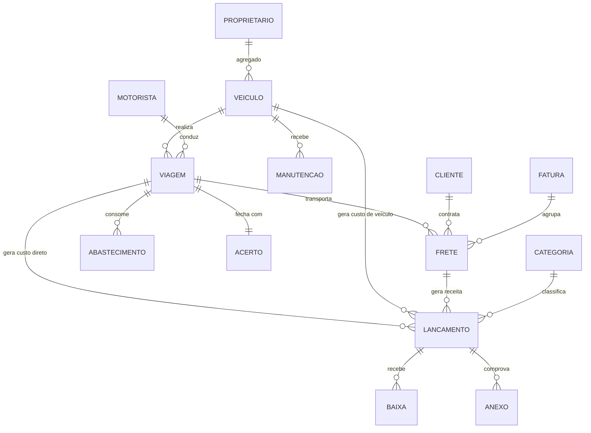

# 03 — Modelo de dados proposto

Modelo conceitual. Nomes finais e tipos exatos saem na migration, depois das
respostas do questionário — principalmente o bloco de rateio (viagem × frete) e
o de remuneração de agregado.

---

## Diagrama de relacionamento



---

## Entidades

### `empresa` (registro único)
`id`, `razao_social`, `cnpj`, `timezone`, `config_rateio` (JSON: critérios da
cascata de custo)

> Sistema **single-tenant**: uma linha só. Serve para os dados do cabeçalho de
> relatório e para os parâmetros de rateio, não para isolamento de dados.

### `usuario`
`id`, `nome`, `email`, `senha_hash`, `perfil`
(`ADMIN` | `FINANCEIRO` | `OPERACAO` | `MOTORISTA`), `motorista_id?`, `ativo`

### `cliente`
`id`, `razao_social`, `cnpj`, `contato`, `prazo_pagamento_dias`,
`forma_faturamento` (`POR_CTE` | `AGRUPADO`), `ativo`

### `proprietario` (dono do agregado)
`id`, `nome`, `cpf_cnpj`, `dados_bancarios` (cifrado), `contato`,
`regra_remuneracao` (JSON — ver abaixo), `ativo`

### `veiculo`
`id`, `placa`, `tipo_posse` (`PROPRIO` | `AGREGADO`),
`proprietario_id?`, `modelo`, `ano`, `eixos`, `tipo_carroceria`,
`capacidade_kg`, `odometro_atual`, `data_aquisicao?`, `valor_aquisicao?`,
`status` (`ATIVO` | `MANUTENCAO` | `INATIVO` | `VENDIDO`)

### `motorista`
`id`, `nome`, `cpf`, `cnh`, `cnh_categoria`, `cnh_validade`,
`vinculo` (`CLT` | `AUTONOMO` | `AGREGADO`), `regra_remuneracao` (JSON),
`veiculo_padrao_id?`, `ativo`

### `viagem` — **unidade de apropriação de custo**
`id`, `numero`, `veiculo_id`, `motorista_id`,
`data_saida`, `data_chegada?`,
`km_inicial`, `km_final?`, `km_carregado?`, `km_vazio?`,
`origem`, `destino`,
`status` (`PLANEJADA` | `EM_ANDAMENTO` | `AGUARDANDO_ACERTO` | `FECHADA`),
`observacoes`

> `km_final >= km_inicial` e `km_inicial >= odometro_atual` do veículo.
> Violação **avisa**, não bloqueia — mas marca a viagem como incompleta.

### `frete` — **unidade de receita** (1 CT-e ou 1 OS)
`id`, `viagem_id?`, `cliente_id`,
`numero_cte?`, `chave_cte?` (44 dígitos, único), `serie?`,
`origem`, `destino`, `produto`, `peso_kg?`, `volume?`,
`valor_frete`, `valor_pedagio_destacado?`, `valor_icms?`, `outras_receitas?`,
`data_emissao`, `data_coleta?`, `data_entrega?`,
`fatura_id?`, `status` (`ABERTO` | `ENTREGUE` | `FATURADO` | `CANCELADO`)

### `abastecimento`
`id`, `veiculo_id`, `viagem_id?`, `motorista_id?`,
`data`, `fornecedor_id?`, `litros`, `valor_litro`, `valor_total`,
`odometro`, `tanque_cheio` (bool), `origem_dado` (`MANUAL` | `IMPORTADO`),
`lancamento_id`

> **km/l** = km percorrido entre dois abastecimentos de tanque cheio ÷ litros do
> segundo. Abastecimento parcial entra no acumulado, não fecha média.

### `manutencao`
`id`, `veiculo_id`, `data`, `odometro`,
`tipo` (`PREVENTIVA` | `CORRETIVA` | `PNEU` | `REVISAO`),
`fornecedor_id?`, `descricao`, `valor_pecas`, `valor_servico`, `lancamento_id`

### `categoria`
`id`, `nome`, `tipo`
(`RECEITA` | `DESPESA`),
**`nivel_custo`** (`DIRETO_VIAGEM` | `VEICULO` | `OVERHEAD`) ← define a camada da
cascata, `categoria_pai_id?`

Pré-carga: Receita de frete · Combustível · Pedágio · Manutenção · Pneus ·
Comissão/diária de motorista · Pagamento de agregado · Salários · Seguro ·
IPVA/Licenciamento · Financiamento · Depreciação · Rastreamento ·
Administrativo · Impostos · Despesa de viagem

### `lancamento` — **o título financeiro único**
`id`, `tipo` (`RECEITA` | `DESPESA`), `categoria_id`,
`descricao`, `valor`,
`data_competencia`, `data_vencimento`, `data_pagamento?`, `valor_pago`,
**apropriação:** `veiculo_id?`, `viagem_id?`, `frete_id?`
**contraparte:** `cliente_id?`, `fornecedor_id?`, `motorista_id?`, `proprietario_id?`
`recorrencia_id?`, `status` (`ABERTO` | `PARCIAL` | `LIQUIDADO` | `CANCELADO`),
`estorno_de_id?`, `criado_por`, `criado_em`

> Regra: lançamento com `data_pagamento` preenchida é **imutável** — correção
> apenas por estorno.

### `baixa`
`id`, `lancamento_id`, `data`, `valor`, `conta_bancaria_id?`, `anexo_id?`

### `fatura`
`id`, `cliente_id`, `numero`, `periodo_inicio`, `periodo_fim`,
`valor_total`, `data_emissao`, `data_vencimento`, `lancamento_id`

### `acerto` (fechamento de viagem)
`id`, `viagem_id`, `tipo` (`MOTORISTA` | `AGREGADO`),
`valor_bruto`, `adiantamentos`, `descontos`, `despesas_reembolsadas`,
`valor_liquido`, `lancamento_id`, `fechado_em`, `fechado_por`

### `recorrencia`
`id`, `descricao`, `categoria_id`, `veiculo_id?`, `valor`,
`dia_vencimento`, `inicio`, `fim?`, `ativo`
→ gera `lancamento` mensal (seguro, IPVA parcelado, financiamento, rastreador,
depreciação, custos administrativos)

### `anexo`
`id`, `entidade`, `entidade_id`, `url`, `nome_arquivo`,
`mime`, `enviado_por`, `enviado_em`

### `auditoria`
`id`, `usuario_id`, `entidade`, `entidade_id`, `acao`,
`dados_antes` (JSON), `dados_depois` (JSON), `criado_em`

---

## Regra de remuneração (JSON)

Estrutura única para motorista e agregado, para o motor de acerto não virar
`if/else` infinito:

```jsonc
{
  "modelo": "PERCENTUAL_FRETE",   // FIXO_MENSAL | PERCENTUAL_FRETE |
                                  // POR_KM | DIARIA | HIBRIDO
  "percentual": 70,               // % do frete (base a definir com o cliente)
  "base_calculo": "FRETE_LIQUIDO",// FRETE_BRUTO | FRETE_LIQUIDO (sem pedágio/ICMS)
  "valor_fixo": 0,
  "valor_km": 0,
  "valor_diaria": 0,
  "quem_paga_combustivel": "AGREGADO",  // AGREGADO | TRANSPORTADORA
  "quem_paga_pedagio": "TRANSPORTADORA",
  "descontos_aplicaveis": ["AVARIA", "MULTA", "ADIANTAMENTO"]
}
```

> Este é o campo com maior risco de retrabalho no projeto. **Bloco D do
> questionário existe só por causa dele.**

---

## Views de relatório (materializadas)

| View | Conteúdo |
|---|---|
| `vw_resultado_veiculo_mes` | receita, custo direto, custo do veículo, margem, km, custo/km, R$/km, km/l |
| `vw_resultado_frete` | DRE em cascata por CT-e, com custo rateado da viagem |
| `vw_resultado_viagem` | consolidado da viagem antes do rateio |
| `vw_resultado_cliente` | margem por embarcador |
| `vw_dre_gerencial` | cascata consolidada do período |
| `vw_fluxo_caixa` | títulos por vencimento, previsto × realizado |

Refresh no fechamento de viagem e em job noturno. Com o volume esperado
(~300 lançamentos/mês) isso é sobra de capacidade.

---

## Algoritmo de rateio

```
1. CUSTO DIRETO DA VIAGEM
   custo_viagem = Σ lançamentos onde viagem_id = V
                    e categoria.nivel_custo = DIRETO_VIAGEM

2. RATEIO VIAGEM → FRETE
   se a viagem tem 1 frete:  custo_frete = custo_viagem
   senão:                    custo_frete = custo_viagem × (valor_frete_i / Σ valor_frete)
   (critério configurável: valor | peso | volume)

3. CUSTO DO VEÍCULO NO PERÍODO
   custo_veiculo_mes = Σ lançamentos onde veiculo_id = X
                         e categoria.nivel_custo = VEICULO
   custo_veiculo_por_km = custo_veiculo_mes / km_rodados_no_mes
   apropriado_na_viagem = custo_veiculo_por_km × km_da_viagem

4. OVERHEAD
   overhead_mes = Σ lançamentos com nivel_custo = OVERHEAD
   apropriado_no_frete = overhead_mes × (valor_frete / receita_total_mes)

5. RESULTADO
   margem_contribuicao = receita − custo_direto
   resultado_veiculo   = margem_contribuicao − custo_veiculo_apropriado
   lucro_operacional   = resultado_veiculo − overhead_apropriado
```

Veículo **agregado** não tem etapa 3 — o custo dele é o pagamento ao
proprietário, que é custo direto da viagem. É justamente o que torna o
comparativo própria × agregado honesto.
